# clustering-top
Se realiza un análisis de agrupación por clustering jerárquico con el objetivo de recomendar a un cliente los productos que ha comprado otra persona que pertenece al mismo clúster. Con base al resultado del análisis, se responden las preguntas: 1) ¿qué productos se recomendaría a Salomé? 2) ¿Qué productos se recomendaría a Stephanía? 3) ¿Qué productos se recomendaría a Lydia? La respuesta está reflejada en función de otros clientes. 
# pre-requisitos
1. Tomar la base de datos: Amazon 
2. Agregar la base de datos a un dataframe de Python
3. Importar las paqueterias necesarias, en este caso se usaron: pandas | numpy | matplotlib.pyplot | os
4. En este ejemplo la base de datos está alojada en mi Escritorio
# paso a paso
1. Importada la base de datos Amazon, 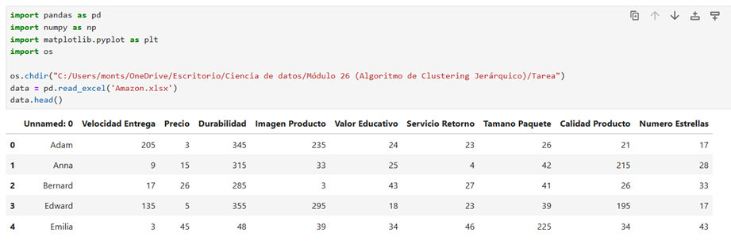
2. Escalamos los datos para tener una mejor estandarización sin contenmplar el valor de “Unnamed: 0”
 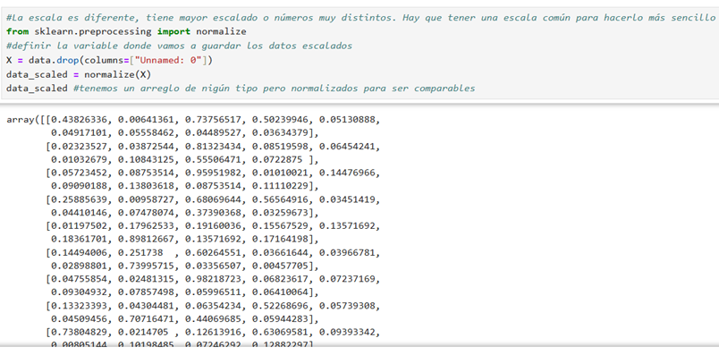
3. Creamos un dataframe, sin contemplar la columna de los nombres
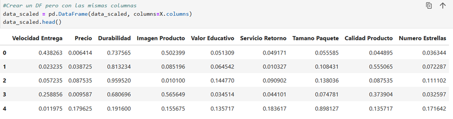
 

4. Ahora vamos a generar el proceso de clustering, donde obtuvimos 3 diferentes grupos:
 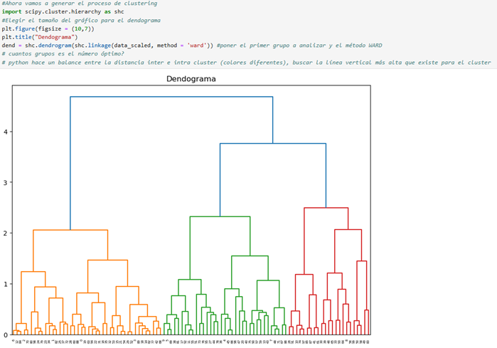
 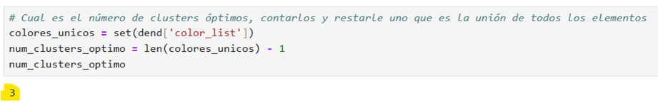

5. Revisamos el número con una línea horizoontal
- Cada rama que no se une por encima de esa línea se considera un cluster separado.
- Las ramas principales que quedan debajo de esa línea son cuántos clusters se formaron.
6. Procedemos a desarrollar el PCA (Análisis de Componentes Principales) es una técnica que sirve para reducir la cantidad de columnas
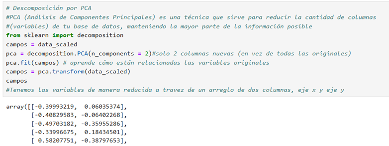
 
7. Vamos a comenzar con la asignación de grupos para saber a que grupo pertenecen si al 0,1 ó 2. Y creamos un dataframe para proceder con la unión de ambas tablas
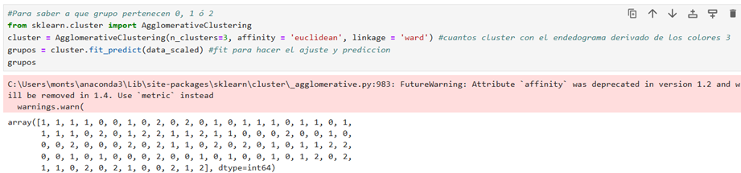
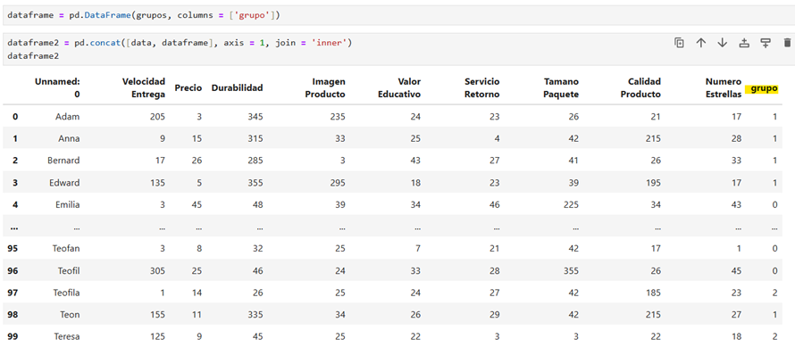
 
Gráfico de como están dispersos los 3 diferentes grupos:
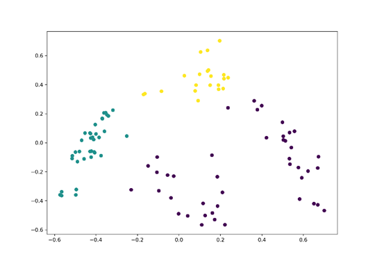
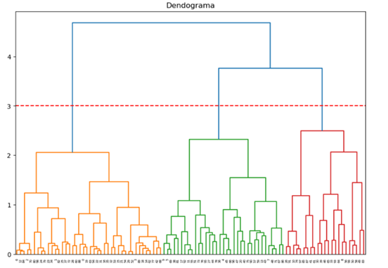

# conclusiones
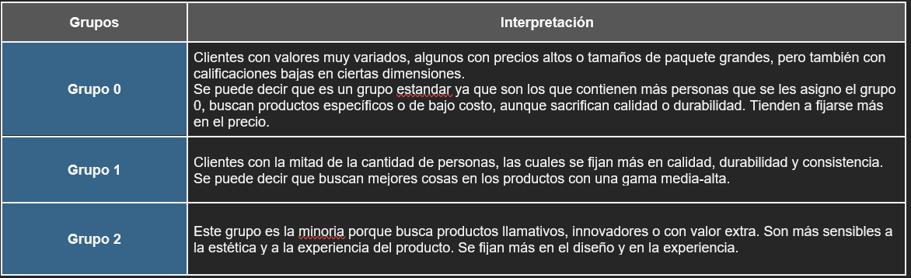
1. **¿Qué productos recomendaría a Salomé?**
Recomendaría a Salomé los mismos productos que compró Emilia y Gabriel, porque pertenecen al mismo grupo y muestran patrones similares de consumo los cuales se fijan más en el precio y a la características específicas.
2. **¿Qué productos recomendaría a Stephanía?**
Recomendaría a Stephania los mismos productos que compraron Pedro e Ines, ya que están en el mismo grupo y tienen un perfil similar en su consumo al fijarse más en la calidad y durabilidad.
3. **¿Qué productos recomendaría a Lydia?**
Recomendaría a Lydia los mismos productos que compraron Ana y Jose, porque comparten el mismo grupo y muestran preferencias por productos de buena calidad y consistencia.

Las imagenes son tomadas del código
